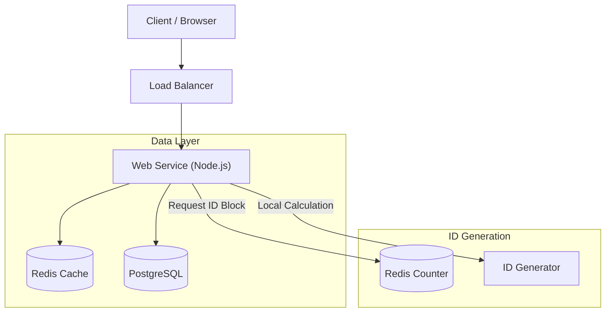

# System Design: Distributed URL Shortener

## 1. Requirements

### Functional
- **Shorten URL**: Users can input a long URL and get a shorter, unique alias.
- **Redirection**: Accessing the short alias redirects to the original URL.
- **Custom Alias** (Optional): Users can request a specific custom alias.
- **Expiration** (Optional): Users can set an expiration time for the link.

### Non-Functional
- **High Availability**: The system should be highly available (e.g., 99.99%) for redirects. Redirects are more critical than new link creation.
- **Low Latency**: Redirection should happen in milliseconds (< 100ms).
- **Scalability**: Support billions of links and high read throughput (100:1 Read/Write ratio).
- **Durability**: Links should stay permanent (unless expired).

## 2. API Design

### REST Endpoints

1.  **Create Short URL**
    - `POST /api/v1/shorten`
    - **Request**:
        ```json
        {
          "long_url": "https://www.google.com/...",
          "custom_alias": "my-link", // Optional
          "expiration_date": "2025-12-31T23:59:59Z" // Optional
        }
        ```
    - **Response**: `201 Created`
        ```json
        {
          "short_url": "http://short.ly/abc1234",
          "short_code": "abc1234"
        }
        ```

2.  **Redirect**
    - `GET /:short_code`
    - **Response**: `302 Found` (Location: `long_url`)
    - *Note: We use 302 (Found) instead of 301 (Moved Permanently) to ensure requests hit our server, allowing us to track analytics and manage expiration.*

## 3. High-Level Architecture

The system follows a typical 3-tier architecture with a heavy emphasis on caching for read scalability.



### Components
1.  **Load Balancer/Gateway**: Distributes incoming HTTP requests to stateless web servers.
2.  **Web Service**: Stateless Node.js application handling the logic.
3.  **Distributed Cache (Redis)**: Stores hot `short_code -> long_url` mappings. Handles ~99% of read traffic.
4.  **Database (PostgreSQL)**: Durable source of truth.
5.  **ID Generator**: A strategy to generate unique, non-colliding IDs.

## 4. Deep Dives & Trade-offs

### 4.1. Storage & Database Choice

**Decision**: **PostgreSQL** (Relational) vs. **NoSQL** (DynamoDB/Cassandra).

*   **Trade-off**:
    *   **NoSQL**: Easier horizontal scaling, simple Key-Value lookup. Great for massive scale (trillions of links).
    *   **SQL (Postgres)**: ACID compliance, mature tooling, sufficient performance for billions of rows if indexed correctly.
*   **Choice**: **Postgres**.
    *   *Reason*: For a Senior Engineer interview, showing you can scale a relational DB (indexes, eventual partitioning) is valuable. Postgres is reliable, cheap, and handles 1B+ rows easily with proper indexing.
    *   **Schema**:
        ```sql
        CREATE TABLE urls (
            id BIGINT PRIMARY KEY, -- 64-bit integer
            short_code VARCHAR(7) UNIQUE, -- Indexed for fast lookup
            long_url TEXT,
            created_at TIMESTAMP,
            expires_at TIMESTAMP
        );
        ```

### 4.2. Short Code Generation (The Core Problem)

**Requirement**: Generate a unique 7-character string (e.g., `[a-zA-Z0-9]`).
**Available Space**: $62^7 \approx 3.5 \text{ Trillion}$ combinations. Plenty for our needs.

**Approaches**:

1.  **Runtime Hashing (MD5/SHA256)**: 
    *   Hash the long URL + User Info. Take first 7 chars.
    *   *Problem*: Collisions. Requires "check-then-insert" logic, which slows down writes and has race conditions.
    
2.  **Offline Key Generation (KGS)**:
    *   A separate service pre-generates unique random strings and stores them in a DB/queue.
    *   *Pros*: Fast runtime allocation.
    *   *Cons*: Complexity of managing the pool. Concurrency issues if two servers grab the same key.

3.  **Unique ID Counter + Base62 Encoding (Chosen Strategy)**:
    *   Generate a unique sequential integer ID.
    *   Convert to Base62 (e.g., ID `100` -> `1C`).
    *   *Pros*: Guaranteed uniqueness. No collisions. Simple math.
    *   *Cons*: Sequential IDs might be guessable (Security risk).
    *   *Mitigation*: We will use a **Distributed Block Allocator** to prevent guessability and database bottlenecks.

### 4.3. Distributed ID Generation

Using a single database auto-increment is a bottleneck. We use **Redis** to allocate "blocks".

*   **Mechanism**:
    1.  Global Redis Key: `global_counter`.
    2.  Server A starts up. Does `INCRBY global_counter 1000`.
    3.  Redis returns `2000`.
    4.  Server A now "owns" IDs `1001` to `2000`. It keeps this range in-memory.
    5.  Server A assigns `1001` to the first request, `1002` to the second, etc.
    6.  When exhausted, it requests a new block.
*   **Why**:
    *   **Performance**: One Redis call per 1000 requests. Extremely fast.
    *   **Scalability**: No single database write lock per request.
    *   **Reliability**: If a server crashes, we lose at most 1000 IDs (acceptable waste in a space of 3.5 Trillion).

### 4.4. Caching Strategy

Since Reads >> Writes, caching is critical.

*   **Eviction Policy**: LRU (Least Recently Used). We want hot links (viral posts) to stay in cache.
*   **Pattern**: Cache-aside.
    1.  App checks Redis.
    2.  Miss? Check DB.
    3.  Found? Write to Redis with TTL (e.g., 1 hour).
*   **Handling Expiration**:
    *   If a link is expired in DB, we verify logic in code before returning.
    *   Redis keys also have TTL to naturally expire.

## 5. Deployment Strategy (Azure & AWS)

### Containerization
The app is fully containerized (Docker). This allows it to run on any cloud provider's container service.

### Azure (Cost-Effective for Credits)
**Recommended**: **Azure Container Apps**.
*   **Serverless Containers**: You only pay for CPU/Memory when the app is scaling.
*   **KEDA Support**: Can auto-scale to zero if no one is using it (saves money).
*   **Database**: Azure Database for PostgreSQL (Flexible Server - Burstable tier B1ms is very cheap).
*   **Cache**: Azure Cache for Redis (Basic C0 tier).

### AWS
**Recommended**: **AWS App Runner** or **ECS Fargate**.
*   **App Runner**: Easiest to deploy (Connect GitHub -> Deploy).
*   **Database**: RDS Postgres (t3.micro for free tier).
*   **Cache**: ElastiCache (t3.micro).

## 6. Future Improvements / "Below the Line"

1.  **Analytics**: Push click events to a message queue (Kafka) -> Data Warehouse (Snowflake/BigQuery) to avoid slowing down the redirect path.
2.  **Rate Limiting**: Prevent abuse by limiting requests per IP/User (Redis-based token bucket).
3.  **Geo-Routing**: Deploy replicas in multiple regions (US, EU, Asia) and use DNS (Route53/Azure Traffic Manager) to route users to the nearest node.
